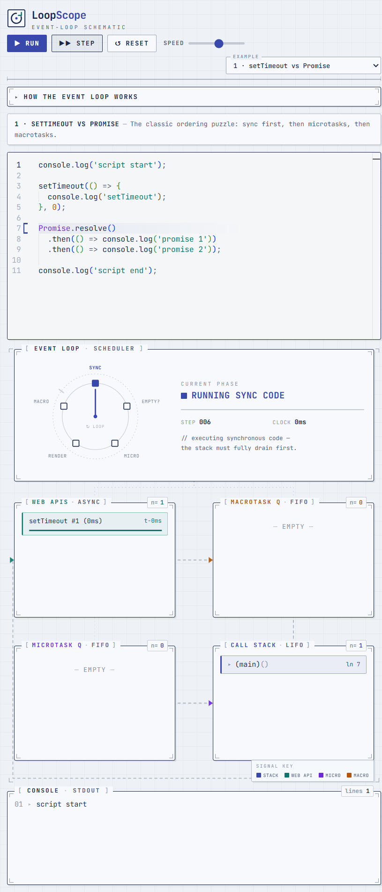

# LoopScope — Interactive JavaScript Event Loop Visualizer

> Write JavaScript, press **Run**, and watch the call stack, Web APIs, microtask
> queue, and macrotask queue animate step-by-step as a custom engine model
> executes your code.

LoopScope is an **educational simulator** (not a live profiler). Because the
real JS engine exposes no API to read the live call stack, LoopScope parses your
code with [`acorn`](https://github.com/acornjs/acorn) and runs it through a
custom, generator-based tree-walking interpreter. Each step advances exactly one
node evaluation and emits an immutable snapshot of the model, so every push, pop,
enqueue and dequeue can be animated frame-by-frame.


<!-- Replace docs/screenshot.png with a real capture of the running app. -->

## What it teaches

The event loop is the single most misunderstood part of JavaScript. LoopScope
makes its rules tangible:

1. **Synchronous code runs to completion** — the call stack fully drains before
   anything asynchronous happens.
2. **Web APIs** hold async work (`setTimeout` timers) until it is ready, then
   hand the callback to the **macrotask queue**.
3. Once the stack is empty, the **entire microtask queue** is drained
   (`Promise` callbacks, `queueMicrotask`) — *including* microtasks queued by
   other microtasks.
4. The browser **renders**, then exactly **one macrotask** is pulled, and the
   cycle repeats from step 3.

`async`/`await` is desugared into the promise model, so you can see how an async
function suspends at `await` and resumes later as a microtask.

## Features

- **Custom stepping interpreter** — full control over async desugaring and step
  granularity (no off-the-shelf interpreter library).
- **Five visual panels**: Call Stack, Web APIs, Microtask Queue, Macrotask
  Queue, plus a pulsing **Event Loop** phase indicator.
- **Controls**: Run, Step, Pause, Reset, and a speed slider.
- **Current-line highlighting** in a Monaco editor as each step executes.
- **Animated transitions** (Framer Motion) as items move between panels, with
  consistent color-coding (stack · web api · microtask · macrotask).
- **5 preset examples** covering the classic event-loop gotchas.
- **On-screen console** that captures `console.log` output and interpreter
  errors gracefully (the UI never crashes).
- Responsive, dark-mode-first, modern aesthetic.

## Supported JavaScript subset

Variable declarations (`let`/`const`/`var`), function declarations &
expressions, arrow functions, `console.log`, `setTimeout`/`setInterval`
(step-capped) / `clearTimeout`, `Promise` (+ `resolve`/`reject`/`all`),
`.then`/`.catch`/`.finally`, `queueMicrotask`, `async`/`await`, template
literals, objects & arrays (with common methods), `if/else`, `for`/`while`,
`try`/`catch`/`finally`, and the usual operators.

## Tech stack

- **Vite + React + TypeScript**
- **Tailwind CSS** for styling
- **acorn** for parsing JS to an AST
- **Framer Motion** for enter/exit animations
- **Monaco Editor** for the code input pane

## Architecture

The codebase keeps the three concerns in clearly separated modules so each can
be debugged in isolation:

```
src/
├── interpreter/            # framework-agnostic core (no React imports)
│   ├── types.ts            # Snapshot / model types shared with the UI
│   ├── values.ts           # runtime value representations + helpers
│   ├── environment.ts      # lexical scope chain
│   ├── machine.ts          # mutable state: stack, queues, timers, promises
│   ├── interpreter.ts      # generator-based tree-walking evaluator
│   ├── natives.ts          # console / timers / Promise / Math globals
│   └── eventLoop.ts        # the event-loop driver + `Runner` (step API)
├── components/             # React visualization layer (consumes Snapshots)
│   ├── CallStack.tsx  WebApis.tsx  MicrotaskQueue.tsx  MacrotaskQueue.tsx
│   ├── EventLoop.tsx  ConsolePanel.tsx  Controls.tsx  Legend.tsx
│   ├── CodeEditor.tsx  Panel.tsx  QueuePanel.tsx
├── presets.ts              # the 5 example programs
└── App.tsx                 # orchestration + layout
```

The interpreter is the foundation: `Runner.step()` advances the master generator
one step and returns a `Snapshot`. The React layer only ever reads snapshots —
it never touches interpreter internals.

## Getting started

```bash
npm install
npm run dev      # start the dev server (http://localhost:5173)
```

> The Monaco editor is loaded from a CDN at runtime, so the first load needs a
> network connection.

Other scripts:

```bash
npm run build    # type-check + production build into dist/
npm run preview  # preview the production build locally
```

## Deploy

### Vercel

1. Import the repository in Vercel.
2. Framework preset: **Vite**. Build command `npm run build`, output dir `dist`.
3. Deploy — no extra configuration required (the build uses a relative base).

### GitHub Pages

The Vite config uses `base: './'`, so the build works from any sub-path.

```bash
npm run build
npx gh-pages -d dist        # publish dist/ to the gh-pages branch
```

Or with GitHub Actions, build on push and deploy the `dist/` folder with
`actions/deploy-pages`.

## License

MIT
